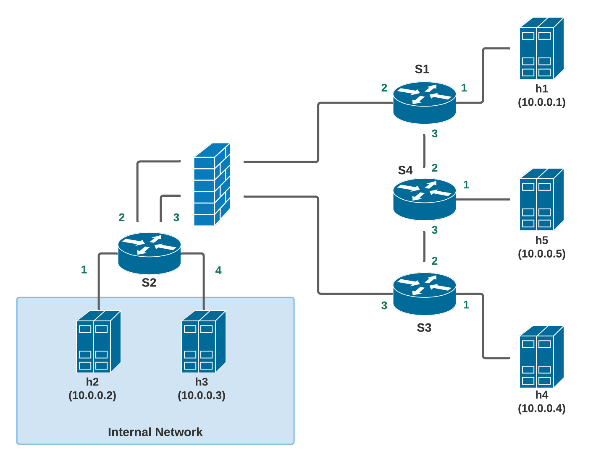

# CMPT 471 Group 16 - Router

Topology Diagram:

<kbd>

</kbd>

## Steps:

#### Installing Requirements
Clone the *p4app* that is used for the Project. This allows building, running, debugging, and testing P4 programs.
```
cd ~/
git clone --branch rc-2.0.0 https://github.com/p4lang/p4app.git
```
Clone this project repository into desired location.
```
git clone https://github.com/jsa214-jihoon/cmpt471-group16.git
```
#### Main Router
Launch Docker.
On Docker Terminal, cd to the repository folder containing *myrouter.p4app* folder and run the following command.
```
~/p4app/p4app run myrouter.p4app
```

#### Router with Bloom Counter

Launch Docker.
On Docker Terminal, cd to the repository folder containing *myrouterbloomcounter.p4app* folder and run the following command.
```
~/p4app/p4app run myrouterbloomcounter.p4app
```
